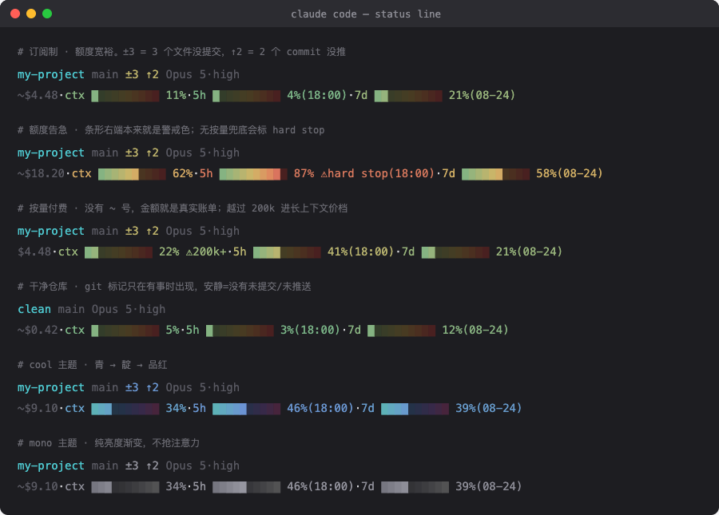

<div align="center">


# usage-statusline

### 给 **Claude Code** 的状态栏

**花了多少、上下文还剩多少、限额还够不够、撞满会不会直接停——都在你已经在看的那一行里。**

[](https://claude.com/claude-code)
[](https://docs.claude.com/en/docs/claude-code/statusline)
[](./LICENSE)
[](https://www.python.org/)
[](#工作原理)
[](./scripts/statusline.py)

[English](./README.en.md) · [快速安装](#安装) · [订阅 vs 按量](#订阅制-vs-按量付费) · [扩展段](#扩展段把你自己的东西加上去) · [同类对比](#同类项目对比)



`Claude Code` · `statusline` · `状态栏` · `用量监控` · `限额预警` · `rate limit` · `context window` · `token 用量` · `订阅制` · `按量付费` · `CLI` · `零依赖`

<sub>社区项目，非 Anthropic 官方出品。Claude 与 Claude Code 是 Anthropic 的商标。</sub>

</div>

## 它解决什么问题

Claude Code 本身不告诉你「还能跑多久」。等你撞上限额，工作已经断在半路了。

这个状态栏把三件事常驻在你眼前：**上下文快满了吗**、**5 小时/7 天限额还剩多少**、**这次会话花了多少钱**。而且它会区分你是订阅制还是按量付费——因为这两种账户，同一个数字含义完全不同。

## 读懂这一行

```
my-project main ±3 ↑2  Opus 5·high                 ← 目录 + git 状态 + 模型（+ 你自己的扩展段）
~$4.48·ctx █░░░░░░░░░ 11%·5h █░░░░░░░░░ 4%(15:40)·7d ██░░░░░░░░ 21%(08-24)
```

| 片段 | 含义 |
|---|---|
| `my-project` | 当前目录名 |
| `main` | git 分支（不在仓库里就不显示） |
| `±3` | **3 个文件改了还没提交**（含未跟踪的新文件） |
| `↑2` | **2 个 commit 还没推**；落后远端则是 `↓N` |
| `Opus 5·high` | 当前模型 + effort 档位；开了 fast mode 会多一个 `·fast` |
| `~$4.48` | 本次会话消耗。**波浪号 `~` 表示「等价金额，非实付」**，详见下一节 |
| `ctx … 11%` | 上下文窗口占用 |
| `5h … 4%(15:40)` | 5 小时限额用了 4%，15:40 重置 |
| `7d … 21%(08-24)` | 7 天限额用了 21%，08-24 重置 |

git 标记**只在有事时才出现**：工作区干净且和远端同步，就只剩一个分支名。
所以状态栏安静 = 仓库干净，不用再去敲 `git status` 确认。

模型和 effort 档位常驻，是因为它们**会被临时切换然后忘记切回来**——
用一个本来只想临时开的档位跑完一下午，是笔安静的开销。

> 这里刻意没用云朵之类的 emoji 图标：emoji 在终端里是双宽字符，宽度还随字体变，
> 会让整行左右跳动、把后面的条形挤歪。`±↑↓` 是等宽的，对齐稳定。

分支、领先/落后、变动数是**一次** `git status --porcelain=v2 --branch` 拿到的，
不是分别调三次 git。638 个文件的仓库实测只比空仓库多 ~2ms；超时 1 秒兜底，
git 慢或不存在时就当没有 git 信息，状态栏照常渲染。

每个指标是 10 格色条，**亮色 = 已用，暗色 = 剩余**。非零占用至少点亮一格，所以 1% 不会看起来像 0%。

条形的每一格按**它自己在轨道上的位置**着色，而不是按当前值整条同色——所以**右端天生就是警戒色**，
你在填到那里之前就看得见危险区在哪：

```
5h ██████████  ← 左边平静，右边告警，进度推过去时颜色自然升温
```

> 用同一个实心块靠颜色区分，而不是 `▓░` 这类深浅字符——后者在很多字体里会糊成一片网点，看不出边界。

## 主题

内置三套主题，**默认就调好了，不需要配置**。改环境变量即可切换：

```bash
export USAGE_STATUSLINE_THEME=cool     # default | cool | mono
```

| 主题 | 色带 | 适合 |
|---|---|---|
| `default` | 灰绿 → 琥珀 → 珊瑚红 | 默认。刻意做得不饱和，额度还多时安静待在角落，不发光晃眼 |
| `cool` | 青 → 靛 → 品红 | 暗色主题下，绿色容易读成「终端绿」而失去警示意味时用 |
| `mono` | 纯亮度灰阶 | 完全不要色相，让状态栏隐进终端里，需要时才浮现 |

三套都保持同一个语义：**左边平静、右边告警**。主题只换配色，不换「颜色在告诉你什么」。

支持 24 位真彩（`COLORTERM=truecolor`）；不支持的终端自动降级到 8 色，设了 `NO_COLOR` 则退回 `▓░` 字符区分。

## 订阅制 vs 按量付费

这是最容易看错的地方：**同样一个 `$4.48`，两种账户的含义完全不同。**

| | 显示 | 这个金额是什么 | 真正约束你的是 |
|---|---|---|---|
| **订阅制**（Pro / Max / Team） | `~$4.48` | 按 API 价目表折算的**等价消耗**，不会真的扣款 | 5h / 7d 限额条 |
| **按量付费**（API credits） | `$4.48` | **真实账单**，实打实要付的钱 | 你的余额 |

所以订阅用户盯 `$` 是没用的——盯限额条才对。反过来按量用户，限额条不是主要矛盾，`$` 才是。

### `⚠hard stop` 是什么

订阅制超出限额后，有些账户会自动转为按量付费继续跑（超额计费），有些会**直接停到窗口重置为止**。区别取决于你有没有开启并且还有余额支持超额用量。

当某个限额窗口 **≥80%** 且**没有按量兜底**时，状态栏会标出来：

```
5h █████████░ 87% ⚠hard stop(15:40)
```

意思是：再跑下去不是「多花点钱」，而是**直接卡住，得等到 15:40**。提前知道，你可以决定是现在收尾还是换个账户。

（按量付费账户不会显示这个标记——它没有「兜底」这一说，超了就是继续计费。）

### `→full` ——「照这个烧法撑不到重置」

百分比本身不告诉你「还够不够用完这一段」。所以 5 小时窗口会按你**当前的燃烧速度**外推：
如果会在窗口重置**之前**撞满，就标出预计撞满的时刻：

```
5h █████░░░░░ 46%(18:00) →full 14:46
```

读作：5h 窗口 18:00 才重置，但按现在这个速度，**14:46 就会烧光**。

烧得比重置慢就不显示——这种情况没什么可说的，也就不说。

**只有 5 小时窗口做预测，7 天窗口不做。** 这是刻意的：把「刚才一小时的活跃速度」外推到
未来三天，等于假设你 72 小时不睡觉地写代码，结果是几乎任何持续使用都会触发预警——
一个总在报警的预测器是噪音，不是信息。5 小时窗口内你大概确实还在连续工作，斜率才有意义。

另外两道防胡说的闸：至少 **10 分钟**采样跨度才敢外推（刚重置完拿两个挨着的点算斜率，
只会算出很自信的胡话）；窗口一旦重置（`resets_at` 变了）旧采样点自动失效，
不会把上个窗口的斜率拖过来。

预测依赖一个采样文件，见 [它写的唯一一个文件](#它写的唯一一个文件)；不想要可以关掉。

### `⚠200k+` 是什么

上下文超过 20 万 input token 后会进入**长上下文价档**，单价更高。这只对真正花钱的
按量付费账户有意义，所以订阅账户不会被这个标记打扰：

```
ctx ██░░░░░░░░ 22% ⚠200k+
```

标记只陈述事实（已越过 200k），不写「贵 N 倍」——具体倍数各模型不同。

判断依据取自 `~/.claude.json` 的 `oauthAccount.billingType`、`hasExtraUsageEnabled` 和 `cachedExtraUsageDisabledReason`。读不到就安全降级：不显示波浪号，也不报警。

## 安装

### 方式 A —— 作为 Claude Code Skill（推荐）

```bash
git clone https://github.com/webkubor/usage-statusline ~/.claude/skills/usage-statusline
```

打开 Claude Code 执行：

```
/usage-statusline
```

Claude 会读 `SKILL.md`，把脚本装到 `~/.claude/statusline/usage.py` 并写进 `~/.claude/settings.json`。
如果你已经配了别的 `statusLine`，它不会静默覆盖——会先告诉你现在配的是什么，问过你再动。

### 方式 B —— 直接跑安装脚本

```bash
git clone https://github.com/webkubor/usage-statusline
cd usage-statusline
./install.sh
```

行为同上，只是没有对话：合并进 `~/.claude/settings.json`（首次会备份成 `settings.json.bak-usage-statusline`），
遇到已存在的**不同** `statusLine.command` 会拒绝覆盖。

装完**重启 Claude Code**（或开个新会话）——`statusLine` 是启动时读的。

## 扩展段：把你自己的东西加上去

想在状态栏显示的**不是用量**（后台任务心跳、队列深度、值班状态、部署状态……），不要改 `usage.py`，
往 `~/.claude/statusline/segments/` 丢一个可执行文件就行：

```bash
cat > ~/.claude/statusline/segments/10-queue.sh <<'EOF'
#!/bin/sh
cat > /dev/null                     # payload 从 stdin 进来，用不上也要读掉
echo "queue $(ls ~/jobs | wc -l | tr -d ' ')"
EOF
chmod +x ~/.claude/statusline/segments/10-queue.sh
```

效果就是演示图第三行那样，追加在目录名后面：

```
my-project main  ⏱ deploy ok·queue 3
$4.48·ctx █░░░░░░░░░ 11%
```

约定：

- 按文件名顺序执行（用 `10-`、`20-` 前缀排序）
- 每个段从 stdin 收到**和主脚本同一份 payload JSON**
- **stdout 第一行**会被追加到第一行；不输出就不显示
- 可以用 ANSI 颜色；自行处理 `NO_COLOR`
- 段失败、超时（1 秒）、没有可执行位 → 静默跳过。**坏掉的段永远不会弄坏你的状态栏**

段存在仓库之外，所以升级/重装都不会碰它们，你的私有内容也不会进公开 checkout。

### 或者：反过来包住这个脚本

如果你想保留自己的脚本当入口，在里面调它就行：

```bash
usage=$(python3 ~/.claude/statusline/usage.py <<< "$payload")
echo "${你自己的段}  ${usage}"
```

## 工作原理

Claude Code 每次渲染状态栏，会把一份 JSON payload 通过 stdin 喂给 `settings.json` 里 `statusLine` 配置的命令。
本脚本读这份 payload，输出最多两行。用到的字段：

- `cost.total_cost_usd`
- `context_window.used_percentage`
- `rate_limits.five_hour.{used_percentage,resets_at}`
- `rate_limits.seven_day.{used_percentage,resets_at}`
- `workspace.current_dir` / `cwd`（目录名 + git 分支）

任何字段缺失都只是跳过——脚本不会报错，哪怕输入是坏 JSON，也不会弄坏你的状态栏。

无网络请求，除了 `python3`（Claude Code 本来就要）和可选的 `git` 之外没有依赖。

### 它写的唯一一个文件

`~/.claude/statusline/history.jsonl` —— 只为 [`→full` 燃尽预测](#full-照这个烧法撑不到重置) 存用量采样点：

- **纯缓存**：删掉只会让 `→full` 预测消失一阵子，其他一切照常
- **不会长大**：每 60 秒最多记一个点，最多留 400 行，**17 KB 封顶**
- **坏了不影响**：解析失败的行直接跳过；整个文件读不了就当没有预测
- **不想要就关**：`export USAGE_STATUSLINE_NO_HISTORY=1`，脚本回到完全无状态

除此之外脚本不写任何东西。

## 同类项目对比

Claude Code 状态栏这个赛道已经很热闹，而且有比本项目**功能全得多**的成熟方案。先说结论：
**要 powerline 分段、要图形化配置器、要 Git PR/CI 状态，去用 ccstatusline；
要装完不用调就好看、且 440 行源码能一口气读完，用这个。**

| | **usage-statusline** | [ccstatusline](https://github.com/sirmalloc/ccstatusline) | [claude-powerline](https://github.com/Owloops/claude-powerline) | [CCometixLine](https://github.com/Haleclipse/CCometixLine) |
|---|---|---|---|---|
| Star | — | 12.4k | 1.1k | 3.4k |
| 实现 | 单文件 Python，~440 行 | TypeScript / npm | TypeScript / npm | Rust 二进制 |
| 运行依赖 | **无**（`python3` Claude Code 自带） | Node.js | Node.js | 预编译二进制 |
| 配置 | **零配置**，装完即用 | TUI 配置器 | JSON 配置 | 配置文件 |
| 5 小时限额 | ✅ | ✅ | ✅ | — |
| 7 天限额 | ✅ | ✅ | — | — |
| 订阅 / 按量识别 | ✅ 波浪号区分 | 部分（显示 extra usage 金额与币种） | — | — |
| **无兜底硬停预警** | ✅ `⚠hard stop` | 未见 | 未见 | 未见 |
| **燃尽速率预测** | ✅ `→full 14:46`（限 5h 窗口） | 未见 | 未见 | 未见 |
| 自定义扩展 | 丢一个可执行文件进目录 | widget 系统 | segment 配置 | — |
| 主题 / 渐变 | ✅ 3 套主题，零配置默认好看 | ✅ 需在 TUI 里调 | ✅ | ✅ |
| Powerline 分段 | ❌ | ✅ | ✅ | ✅ |
| Git 变动 / 未推送 | ✅ `±3 ↑2`，一次调用 | ✅ | ✅ | ✅ |
| Git PR / CI 状态 | ❌（可用扩展段自己接） | ✅ | ✅ | — |

> 对比依据是各项目 2026-08 的公开 README，`—` 表示其 README 中未提及、**不代表一定没有**。
> 本项目 star 数留空是因为它就是个人自用工具开源出来的，不跟上面几个比体量。

**什么时候不该选这个**：你想要 powerline 分段、图形化配置器、Git PR/CI 状态、更细的用量拆分
（周用量、按模型、超额金额币种）——这些 ccstatusline 都有，本项目没有也不打算做。

**什么时候适合选这个**：

- 你不想为一条状态栏引入 Node 依赖
- 你想**装完就好看，不想为了好看先学一套配置系统**
- 出问题时你想一口气读完全部源码，而不是翻一个 npm 包
- 你想加自己的东西，但不想学 widget/segment 那套抽象——丢个可执行文件进目录就完事
- 你想知道**撞满限额到底会不会硬停**，而不只是看到一个 100%

## 卸载

删掉 `~/.claude/settings.json` 里的 `statusLine` 字段（或恢复 `settings.json.bak-usage-statusline`），
再删 `~/.claude/statusline/usage.py` 和 `~/.claude/statusline/history.jsonl`。
`~/.claude/statusline/segments/` 里的扩展段是你自己的东西，想清就单独删。

## License

MIT —— 见 [LICENSE](./LICENSE)。
